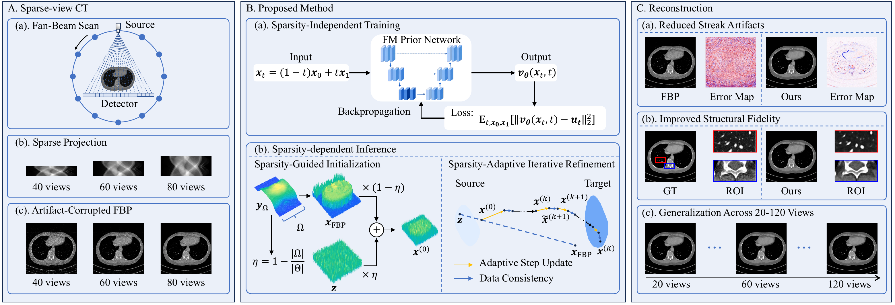
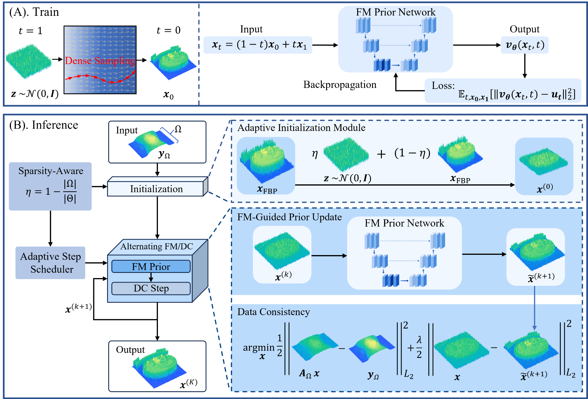
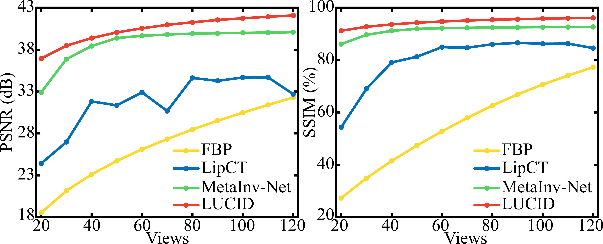
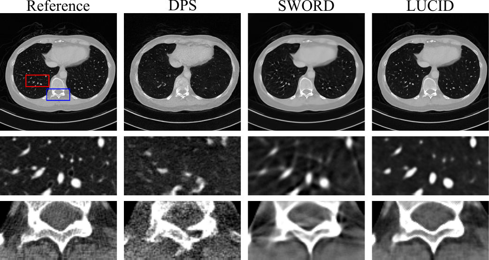

# LUCID: Learned Undersampling-Adaptive CT Image Reconstruction with Deterministic Flow Matching

**Jigang Duan, Jiayi Wang, Heran Wang, Ping Yang, Genwei Ma, and Xing Zhao**  

> **Repository status:** The code is currently being organized and will be released in this repository. This preliminary version provides an overview of LUCID and representative experimental results.

## Abstract

Sparse-view CT reduces radiation dose and acquisition time by using fewer projection views, but angular undersampling makes reconstruction severely ill-posed, often resulting in streak artifacts, structural blurring, and loss of fine details. Existing regression-based methods commonly learn sampling-specific reconstruction mappings, whereas generative methods may produce hallucination-like structures inconsistent with the acquired projections under severe undersampling. We propose LUCID, a sparsity-controlled generative reconstruction framework based on deterministic Flow Matching. LUCID decouples sparsity-independent prior learning from sparsity-dependent inference: it learns a sampling-independent Flow Matching prior from high-quality CT images and uses the angular undersampling level to explicitly control the inference trajectory. Specifically, sampling sparsity determines a degradation-matched initial state and adaptively scales each Flow Matching update, which is followed by projection-domain data consistency using the acquired measurements. This alternating prior-consistency refinement enables a single pretrained generative prior to reconstruct images across different view numbers without view-specific retraining. Experiments across fixed and continuously varying sparse-view settings, including 20-120 views, demonstrate that LUCID consistently suppresses streak artifacts and projection-inconsistent hallucination-like structures while preserving anatomical fidelity.

## Graphical Abstract

  

*Graphical abstract.* LUCID learns a sparsity-independent Flow Matching prior from high-quality CT images and performs sparsity-dependent inference through sparsity-guided initialization, adaptive Flow Matching updates, and projection-domain data consistency. This enables one pretrained prior to reconstruct CT images across continuously varying sparse-view settings while reducing streak artifacts and preserving anatomical structures.

## Method Overview

LUCID is a sparsity-controlled generative reconstruction framework for sparse-view computed tomography (CT) based on deterministic Flow Matching. It learns a sampling-independent generative prior from high-quality CT images and adapts the inference trajectory to the angular undersampling level of each measurement. Projection-domain data consistency is incorporated during inference to promote agreement with the acquired projections and suppress projection-inconsistent hallucination-like structures.

  

*Method overview.* During training, the Flow Matching prior is learned from densely sampled high-quality CT images. During inference, the sampling sparsity level controls both the noise-FBP initialization and the effective update strength. Flow Matching prior updates then alternate with projection-domain data-consistency steps to progressively recover an anatomically faithful reconstruction.

## Highlights

- A single pretrained Flow Matching prior is used across different sparse-view settings without view-specific retraining.
- Sampling sparsity controls both the initial state and the effective update strength during inference.
- Projection-domain data consistency alternates with generative prior updates to improve anatomical fidelity.
- The model generalizes across a broad range of projection-view numbers.

## Representative Results

### Visual comparison under different sparse-view settings

The reconstructed images and corresponding error maps under 40, 60, and 80 projection views are compared with representative model-based, learning-based, and generative reconstruction methods.

  

### Generalization across projection-view numbers

The same pretrained LUCID model remains effective across continuously varying sparse-view settings from 20 to 120 views.

  

### Structural fidelity and hallucination-like structures

ROI comparisons illustrate the preservation of lung parenchymal structures and bony boundaries, together with reduced hallucination-like local structures.

  

## Code

Training and inference code, pretrained models, environment requirements, and usage instructions will be added after the implementation has been organized and verified.

## Citation

Citation information will be added after the paper becomes publicly available.

## Contact

For questions or updates, please open an issue in this repository.
